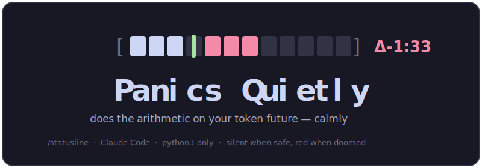

<p align="center"></p>

<p align="center"><a href="README.md">English</a> · <b>Українська</b></p>

# Panics Quietly

Найскромніша смужка інтерфейсу, яку лише можна уявити — а таємно вона рахує арифметику твого токенового майбутнього. Розмовний, дружній до новачків **конфігуратор статус-бара для [Claude Code](https://claude.com/claude-code)**: замість того щоб правити конфіг наосліп, ШІ проводить тебе по тому, що показати — пояснюючи, коли показник корисний, а коли це просто шум — і сам записує конфіг. Мовчить коли ти в безпеці, червоніє коли тобі гаплик. (Команда — `/statusline`.)


```
ctx [██░░░░░░░░░░] .18/1 | 5h [███|█▓▓▓▓▓▓▓] 48% Δ-1:33 ⏷3:20 | 7d [█|▒▒▒▒▒░░░░░] 9% ⏷5d22 | Opus 4.8 · high~
```

## Що воно робить

- **Датчик контексту** — бар + використано / розмір вікна (у мільйонах токенів): `.18/1`.
- **Вікна лімітів (5h / 7d)** зі справжнім прогнозом:
  - `|` **маркер темпу** — де ти мав би бути, якби витрачав рівномірно за часом.
  - **зона-прогноз** — `▒` прогнозована витрата в межах бюджету, `▓` червона якщо виб'єш межу.
  - `Δ-1:33` — *скільки сидітимеш заблокований*, якщо триматимеш цей темп (зʼявляється лише коли випереджаєш; мовчить коли безпечно).
  - `⏷3:20` — час до скидання вікна.
- **модель · ефорт** — живий ефорт приглушеним золотом із `~` коли він `auto` (плинний), яскравий коли закріплений.

Усе читається з JSON payload статус-бара Claude Code. **Єдина залежність — `python3`**: жодних зовнішніх інструментів, жорстких шляхів чи прив'язки до ОС.

## Встановлення

```sh
git clone https://github.com/c0reSun/panics-quietly ~/.claude/skills/statusline
```

Далі в Claude Code:

```
/statusline
```

Скіл визначає твоє середовище, питає мову (English / Українська), робить перевірку гліфів (щоб упасти на ASCII-бари, якщо термінал/шрифт не малює `█ ▒ ░ ⏷ Δ`), пропонує три пресети з живим прев'ю і все записує. Статус-бар оновлюється на наступному рендері — без перезапуску.

## Пресети

| пресет | показує |
|---|---|
| **minimal** | контекст + модель |
| **balanced** *(рекомендовано новачкам)* | контекст + одне вікно лімітів + модель |
| **full** | контекст + 5h і 7d з прогнозом темпу/проєкції/Δ + модель · ефорт |

## Ручне використання (без розмови)

```sh
# перемкнути профіль
python3 ~/.claude/skills/statusline/scripts/apply.py --profile minimal
# повернути той бар, що був до цього
python3 ~/.claude/skills/statusline/scripts/apply.py --restore-previous
# прев'ю будь-якого профілю на синтетичних даних
python3 ~/.claude/skills/statusline/engine.py --demo --profile full
```

Профілі — це звичайні `.conf` файли з коментарями в `~/.claude/statusline/profiles/`, прав їх руками будь-коли. Кожен вибір — лише інформація, ніколи не блокування.

## Як це працює

Стабільний **рушій** (`engine.py`) рендерить активний **декларативний маніфест** (профіль) на кожному кадрі. Перемикання профілю — це зміна вказівника, не регенерація. Дизайн: [SPEC.md](SPEC.md). Пояснення показників: [CATALOG.md](CATALOG.md).

### Автоперемикання (правила)

Профіль може перемикати сам себе за контекстом — додай рядки `rule:` у свій активний `.conf`:

```
rule: model=haiku            -> profile=minimal   # легка модель → тихий бар
rule: dir=~/Projects/Work    -> profile=full      # цей проєкт → повний прогноз
```

Перевіряється на кожному рендері, перший збіг перемагає, без ланцюжків. `dir` — збіг за префіксом шляху, `model` — підрядок назви моделі.

## До відома

- Інтерактивні підказки бувають **English або Українською** — скіл питає на старті. Код, маніфести й документи — англомовні (канон).
- **Чесний дисклеймер QA:** тестовано рівно на одному Mac, руками, у пісочниці, з купою `| sed 's/\x1b\[[0-9;]*m//g'`. Жодного CI, жодних юніт-тестів. Воно деградує до порожнього виводу замість того щоб ламати термінал, але: works-on-my-machine™. Issues і PR вітаються.

## Ліцензія

[MIT](LICENSE)
